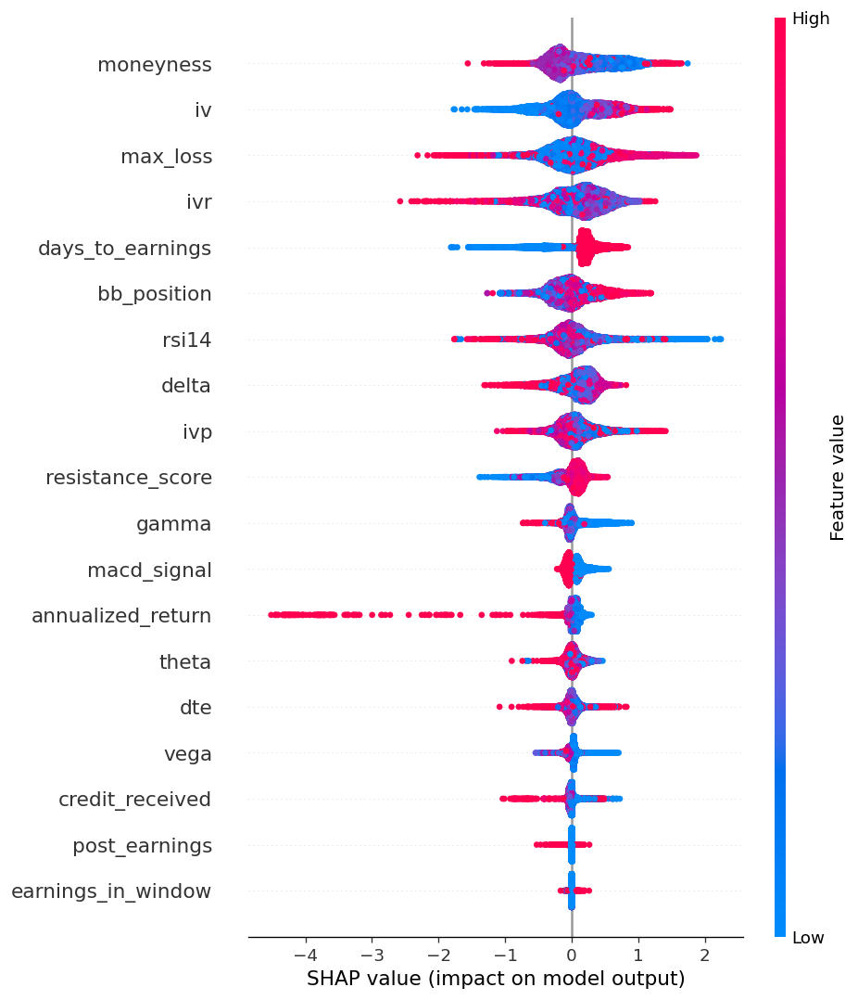

# options-ml-scoring (V7)

A 5-model XGBoost pipeline that scores covered calls and cash-secured puts using 30 features (Greeks, IV regime, technicals, earnings proximity, momentum, vol risk premium).

Trained on 461K simulated option trades from OptionsDX historical EOD chains (2020-2026) across 28 tickers: AAPL, AFRM, AMD, AMZN, APLD, APP, COIN, CRDO, GOOG, HIMS, HOOD, MARA, MSTR, NBIS, NFLX, NVDA, OKLO, ONDS, PLTR, QQQ, RIOT, ROOT, SEZL, SOFI, SPY, TEM, TSLA, ZETA.

## What the models predict

| Model | Question | Key Metric |
|-------|----------|------------|
| `hit50` | Will this short option reach 50% profit? | AUC 0.975 |
| `maxprofit` | What % of max profit at expiry? | R² 0.70 |
| `days50` | How many days to 50% profit? | MAE 2.8 days |
| `ev` | Expected dollar P&L? | R² 0.87 |
| `outcome` | Full win / partial / breakeven / loss? | Accuracy 82.7% |

## V6 → V7

- **V6:** 6 mega-cap tickers (AAPL, NVDA, QQQ, SPX, SPY, TSLA), 19 features, AUC 0.982 — high accuracy but narrow universe. Models learned the specific vol regimes of a small set of large-cap names.
- **V7:** Expanded to 28 tickers including small/mid-cap names (HOOD, HIMS, SOFI, MSTR, RIOT, etc.). Initial AUC crashed to ~0.90 — the model struggled with the wider range of vol regimes and liquidity profiles. Added 11 engineered features (credit_pct, iv_vs_ticker_avg, return_5d/10d/20d, rv_20d, rv_iv_ratio, iv_skew_proxy, dte_bucket, theta_vega_ratio, delta_moneyness) + hyperparameter tuning via two-phase grid search → AUC recovered to 0.975. More generalizable across diverse tickers but slightly lower peak accuracy than V6.

## Important caveats

- Trained on **simulated trades using EOD mid-prices** — no slippage, no commissions, no bid-ask spread
- Backtest numbers are directionally interesting but not a P&L you'd actually realize
- The 88% base win rate for delta-selected premium selling is already high — the model improves on an already-good baseline
- `annualized_return` is the top feature by SHAP importance and is derived from premium, which is closely related to the target. Not target leakage (it's known at entry), but worth noting.

See the V6 → V7 section above for what changed and why.

## Project structure

```
scripts/
  build_training_data.py   # OptionsDX → feature-engineered training CSV
  train_model.py           # Train all 5 XGBoost models
  backtest.py              # Historical P&L simulation
  threshold_tuning.py      # Precision/recall at each confidence threshold
  analyze_shap.py          # Generate SHAP visualizations
  inspect_random.py        # SHAP breakdown for random samples
  inspect_all_models.py    # SHAP across all 5 models
  validate_training_data.py # Data quality checks
  serve_model.py           # FastAPI server for real-time scoring
  polygon-to-optionsdx.py  # Fetch Polygon historical options → OptionsDX format
  enhance_features.py      # Add 11 engineered features + ticker-weighted sampling
  tune_hyperparams.py      # Two-phase grid search for XGBoost hyperparameters
models/
  v6/                      # V6 models (6 tickers, 19 features, AUC 0.982)
  v7/                      # V7 models (28 tickers, 30 features, AUC 0.975)
notebooks/
  example_inference.ipynb   # Load models, score a candidate, SHAP explanation
shap_output/               # SHAP visualizations (PNG)
docs/                      # Technical docs + blog writeup
```

## Quick start

```bash
pip install -r requirements.txt

# Score a single option (using pre-trained models)
python scripts/serve_model.py
# → FastAPI server at http://localhost:8001
# → POST /score with 30 features → returns probability, EV, SHAP explanation

# Retrain from scratch (requires OptionsDX data)
python scripts/build_training_data.py --data-dir /path/to/optionsdx/ --out data/training.csv
python scripts/enhance_features.py data/training.csv
python scripts/train_model.py --data data/training.csv --out models/v7/
python scripts/analyze_shap.py --data data/training.csv --model-dir models/v7/

# Fetch new data from Polygon (requires POLYGON_API_KEY in .env.local)
python scripts/polygon-to-optionsdx.py --all --out data/optionsdx
```

## SHAP feature importance



Top features by mean |SHAP value|:
1. Annualized return
2. Moneyness (strike / underlying)
3. Max loss
4. Delta
5. IV Rank
6. RSI-14

## License

MIT
